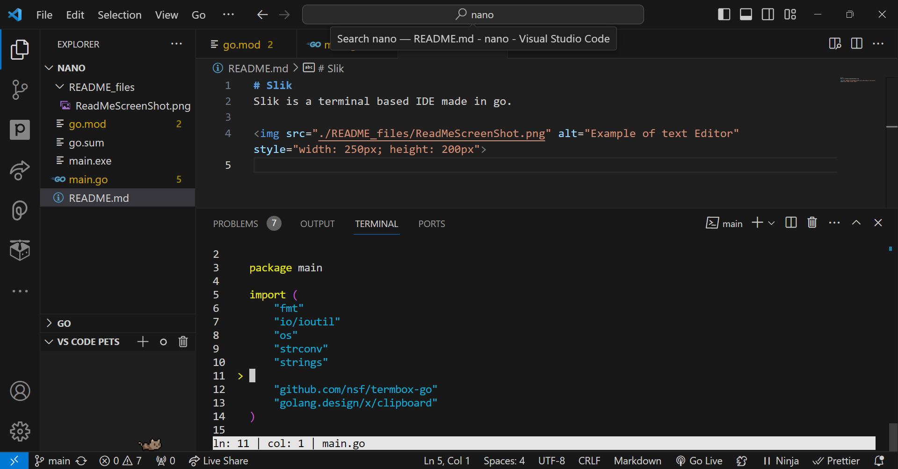

# Slik
Slik is a terminal based IDE made in go.  
It runs on almost any terminal application out there*.

*slik has been tested on cmd.exe, windows terminal app, Vscode but not on linux terminals yet

It is has general purpose syntax highlighting so there isn't custom syntax highlighting for each language.

Download it [here](https://bobdaprogrammer.github.io/slik/)
